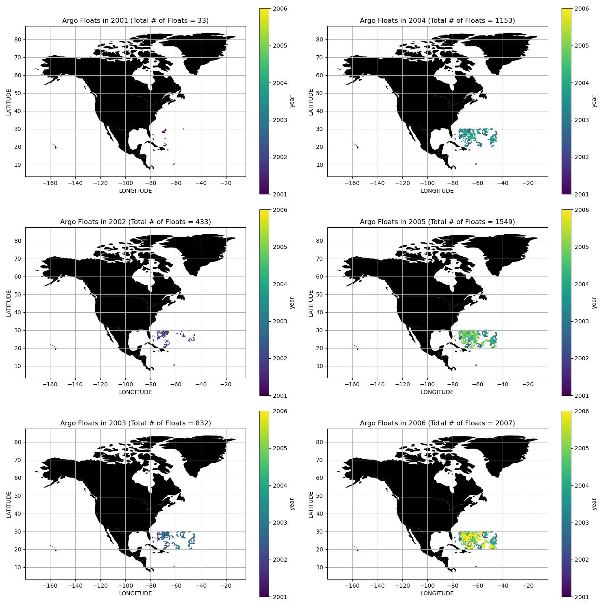
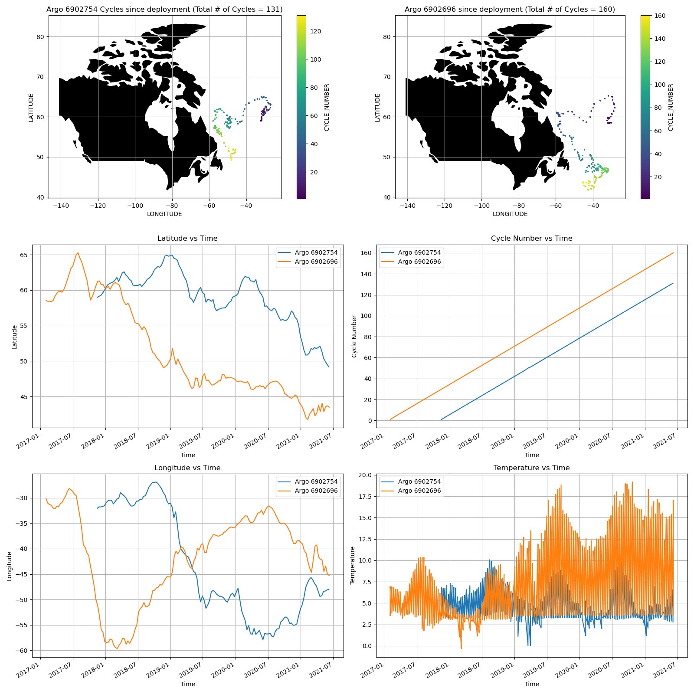

## CMSC 6950 Project - Spring 2021

Course project for CMSC 6950

**Michael King**

Project title: argopy (https://argopy.readthedocs.io/en/latest/index.html)

## Software Setup

Assuming you already have a conda installation such as Miniforge installed, create a new conda environment using:

    conda create -n argopy
    conda activate argopy

The required Python dependencies for argopy can be installed using:

    conda install xarray fsspec scikit-learn erddapy gsw aiohttp netCDF4 dask toolz

I also recommend installing the optional dependencies for full argopy fucntionality using:

    conda install ipython ipywidgets tqdm matplotlib cartopy seaborn

In addition, in order to reproduce the computational tasks performed in my project, install numpy, pandas and geopandas using:

    conda install numpy pandas geopandas

Finally, to install argopy, use the command:

    conda install -c conda-forge argopy

## Using argopy

argopy is a Python library that is used to access, manipulate and visualize Argo float data. To ensure that argopy is installed properly, run the command:

    import argopy
    from argopy import DataFetcher as ArgoDataFetcher
    argo_loader = ArgoDataFetcher()
    argo_loader

If installed properly, the ouput of the previous Python command should read:

    <datafetcher> 'Not initialised'
    Current backend: erddap
    Available fetchers: profile, float, region
    User mode: standard

For exmaples on data fetching, data manipulation and visualization, please read the argopy documentation at:

https://argopy.readthedocs.io/en/latest/index.html

## Computational Tasks

**Task 1** - Change in the total number of Argo floats for an area of interest within a certain time frame.

**Task 2** - Trajectory and temperature variation of two Argo floats through time since their deployment.

To run the computational tasks for my project, run `make` in the command shell. This will produce all data, figures and my project report. To remove all csv and png files afer running `make`, run `make clean` in the command shell. To remove all pdf documents, run `make deepclean` in the command shell.
